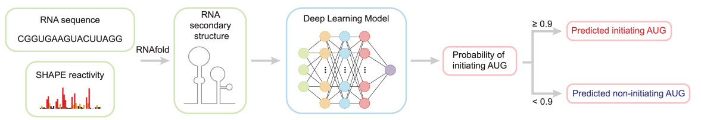
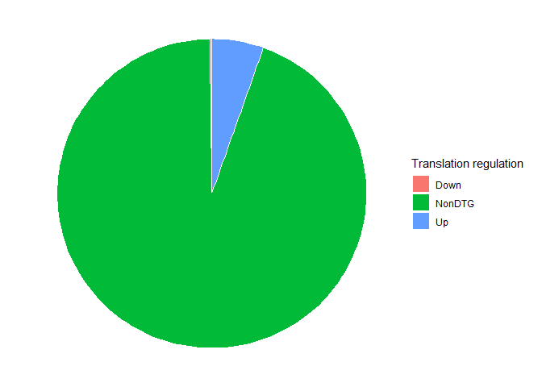
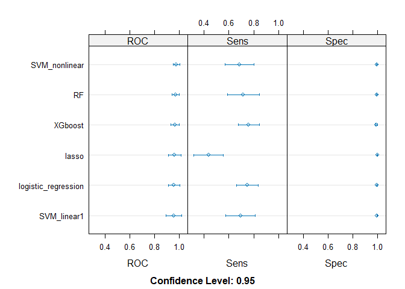
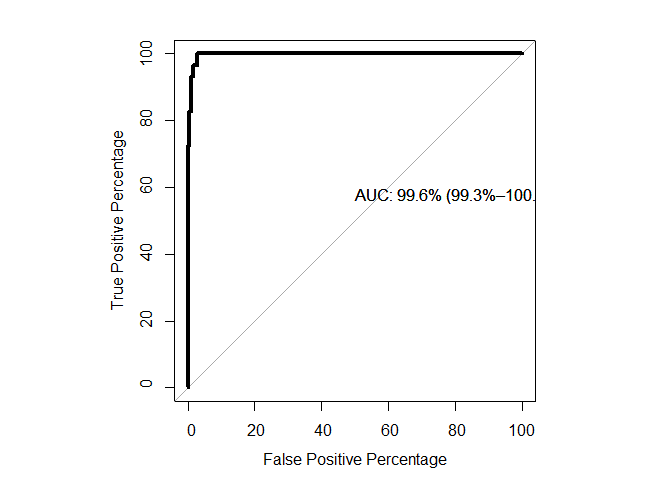

Machine LeaRning Assignment
================
Aimer G. Diaz

# 1. Background and Objectives

Classical work on plant immunity has emphasized transcriptional
induction of defense genes, largely because it has relied on
RNA-seq–based approaches. However, recent studies from the Xinnian Dong
lab and others have established that translational control constitutes a
central and independent regulatory layer, particularly during rapid
responses to pathogen attack \[[1](#ref-xiang2025translational)\].

A series of high-impact papers from the Dong lab has described several,
partly overlapping mechanisms that modulate translation of
immune-related mRNAs during Pattern-Triggered Immunity (PTI) and
Effector-Triggered Immunity (ETI). During PTI, global translation is
broadly repressed through mRNA decapping. Nevertheless, a subset of
defense mRNAs escapes this repression because they contain a purine-rich
"R-motif" in their untranslated regions. This R-motif functions as an
IRES-like element that recruits poly(A)-binding proteins (PABPs) and
enables cap-independent translation \[[2](#ref-xu2017global)\]
\[[3](#ref-wang2022pabp)\] and \[[4](#ref-xiang2023pervasive)\]

Taken together, these studies suggest that translation of immune-related
genes is governed by a complex regulatory code involving:

- PABP binding to purine-rich (R-) motifs

- Cap-independent translation initiation and IRES-like behavior

- Specific sequence motifs (AG-/purine-rich tracts) in untranslated
  regions

- Higher-order RNA structures (e.g. downstream RNA hairpins)

However, because these mechanisms have been described across multiple,
highly focused studies, it remains difficult to assemble a single,
unified model explaining which RNA features actually govern the
translational enhancement of individual immune-related genes upon
pathogen challenge. In particular, it is still unclear whether
translational activation is primarily dictated by the presence and
position of R-motifs and PABP-binding sites, or instead by RNA secondary
structures, such as predicted IRES-like elements or downstream hairpins.

## Objectives of this project

This machine-learning project aims to integrate Dong-lab datasets and
concepts into a unified, predictive framework for immune-gene
translational control. Specifically, using the most recent set of genes
described as carrying immune-responsive structural elements in their 5′
untranslated regions \[[4](#ref-xiang2023pervasive)\], we will evaluate
how well a model trained on these genes can classify immune-related
genes from the original R-motif–based dataset described in
\[[2](#ref-xu2017global)\]. Notably, this dataset comprises 4,727 genes,
representing approximately 17% of all protein-coding genes in
Arabidopsis. The breadth of this gene set suggests that it may, at least
in part, reflect the limited specificity of classical motif-based
prediction approaches, motivating the use of integrative and data-driven
modeling strategies.

## Variables

- *Arabidopsis* gene ID
- RNA hairpin governing translational Initiation (1/-1)
- R motif score
- A proportion (0 to 1)
- 5’UTR length
- Distance to mORF
- Average transcription in unchallenge conditions
- Average transcription in challenge conditions
- Average translation in unchallenge conditions
- Average translation in challenge conditions
- Immune Induction

# 2. Data Import and Cleaning

The data with the structural information of immune related genes
\[[4](#ref-xiang2023pervasive)\] can be found in the [TISnet github
repository](https://github.com/huangwenze/TISnet/blob/main/data/input_data/TIS_data.tsv),
and stored in the [Data
folder](Data/2023.TISNET.Pervasive_downstream_RNA_hairpins_dynamically_dictate_start-codon_selection.tsv),
the Extended figure 5 from \[[4](#ref-xiang2023pervasive)\] explain with
great detail what kind of information has this dataset:

<div style="text-align: center;">

<figure>

<figcaption style="margin-top: 10px;">

The RNA secondary structures downstream of AUGs were predicted by
RNAfold constrained by SHAPE reactivities. TISnet predicted the
probability of initiating AUG by integrating the RNA primary sequence
and secondary structure information. AUGs with probability ≥ 0.9 are
defined as predicted initiating AUGs, and AUGs with probability \< 0.9
are defined as predicted noninitiating AUGs.

</figcaption>
</figure>

<a name="Tisnet_data.png"></a>

</div>

To select the genes that will be used in the following experiments a
series of bash commands were applied to simplify data selection

``` bash
cut -f 2,5,6  2023.TISNET.Pervasive_downstream_RNA_hairpins_dynamically_dictate_start-codon_selection.tsv | awk ' {gsub(/\..*/,"",$1); print $1,$2,$3 } ' | sort | uniq  | sort -k 2 | grep -v "\-1"  > TISNET_Shape_Pos.txt

 cut -f 2,5,6  2023.TISNET.Pervasive_downstream_RNA_hairpins_dynamically_dictate_start-codon_selection.tsv | awk ' {gsub(/\..*/,"",$1); print $1,$2,$3 } ' | sort | uniq  | sort -k 2 | grep  "\-1"  > TISNET_Shape_Neg.txt
 
grep -vf <( awk '{ print $1} ' TISNET_Shape_Pos.txt) TISNET_Shape_Neg.txt  > TISNET_Shape_TrueNeg.txt
 
cat TISNET_Shape_Pos.txt TISNET_Shape_TrueNeg.txt > TISNET_Shape.txt 
```

``` r
TISNET_Shape <- read.csv("Data/TISNET_Shape.txt",sep = " ", header = FALSE)
TISNET_Shape <- TISNET_Shape[,-2]

colnames(TISNET_Shape) <- c("GeneID","AUG_Hairpin")
table(TISNET_Shape$AUG_Hairpin)
```

    ## 
    ##   -1    1 
    ##  535 2857

Which means, 535 genes has RNA structures in the 5’UTR that do not
govern the start codon selection during an immune challenge, while 2857
of them does.

The additional data comes from the supplementary files of
\[[2](#ref-xu2017global)\], specially the [supplementary file
1](https://static-content.springer.com/esm/art%3A10.1038%2Fnature22371/MediaObjects/41586_2017_BFnature22371_MOESM2_ESM.xlsx)
and [supplementary file
5](https://static-content.springer.com/esm/art%3A10.1038%2Fnature22371/MediaObjects/41586_2017_BFnature22371_MOESM6_ESM.xlsx)

``` r
Transcription_Translation <- read.csv("Data/2017.SUP1.Global_translational_reprogramming_RNARibo.csv", header = T)
colnames(Transcription_Translation)<- gsub("geneID","GeneID",colnames(Transcription_Translation))
Features <- read.csv("Data/2017.SUP5.Global_translational_reprogramming_RMOTIF.csv", header = T)

AllInfo <- merge(Transcription_Translation, Features , by.x =  "GeneID", all.x = T)

TISNET_Rmotif <- merge(TISNET_Shape, AllInfo,  by.x =  "GeneID")

TISNET_Rmotif$Rmotif <- is.na(TISNET_Rmotif$score)
TISNET_Rmotif$Rmotif <- as.factor(TISNET_Rmotif$Rmotif)
table(TISNET_Rmotif$AUG_Hairpin)
```

    ## 
    ##   -1    1 
    ##  286 1507

``` r
table(TISNET_Rmotif$Rmotif)
```

    ## 
    ## FALSE  TRUE 
    ##   470  1323

``` r
table(TISNET_Rmotif$Rmotif,TISNET_Rmotif$AUG_Hairpin)
```

    ##        
    ##           -1    1
    ##   FALSE   73  397
    ##   TRUE   213 1110

## Target of Classification

``` r
library(dplyr, quietly = T)
```

    ## Warning: package 'dplyr' was built under R version 4.3.3

    ## 
    ## Attaching package: 'dplyr'

    ## The following objects are masked from 'package:stats':
    ## 
    ##     filter, lag

    ## The following objects are masked from 'package:base':
    ## 
    ##     intersect, setdiff, setequal, union

``` r
TISNET_Rmotif_class<- TISNET_Rmotif %>%
mutate(Regulation = case_when(
    Ribolog2fc >= 1 &  Ribo_adjp < 0.05  ~ "Up", 
    Ribolog2fc <= -1 &  Ribo_adjp < 0.05  ~ "Down", 
    (Ribolog2fc > -1 | Ribolog2fc < 1 ) | Ribo_adjp >= 0.05  ~ "NonDTG"
    ))
# Number of RNA structred genes with differential translation
table(TISNET_Rmotif_class$Regulation,TISNET_Rmotif$AUG_Hairpin)
```

    ##         
    ##            -1    1
    ##   Down      0    3
    ##   NonDTG  272 1419
    ##   Up       13   84

``` r
# Number of R motif genes with differential translation
table(TISNET_Rmotif_class$Regulation,TISNET_Rmotif$Rmotif)
```

    ##         
    ##          FALSE TRUE
    ##   Down       1    2
    ##   NonDTG   446 1245
    ##   Up        23   74

``` r
# Removing ID column 
row.names(TISNET_Rmotif_class) <- TISNET_Rmotif_class$GeneID 
TISNET_Rmotif_class <- TISNET_Rmotif_class[,-1] 

TISNET_Rmotif_class$Regulation <- as.factor(TISNET_Rmotif_class$Regulation)
TISNET_Rmotif_class$AUG_Hairpin  <- as.factor(TISNET_Rmotif_class$AUG_Hairpin )

TISNET_Rmotif_final <- TISNET_Rmotif_class[!is.na(TISNET_Rmotif_class$Regulation),]
TISNET_Rmotif_final <- TISNET_Rmotif_final[,c(-13,-14)]
```

# 3. Exploratory Data Analysis

``` r
library(table1, quietly = T)
```

    ## 
    ## Attaching package: 'table1'

    ## The following objects are masked from 'package:base':
    ## 
    ##     units, units<-

``` r
table1(~.| Regulation, data= TISNET_Rmotif_final[,c(1:6,8,10:15,17:25)])
```

<div class="Rtable1"><table class="Rtable1">
<thead>
<tr>
<th class='rowlabel firstrow lastrow'></th>
<th class='firstrow lastrow'><span class='stratlabel'>Down<br/><span class='stratn'>(N=3)</span></span></th>
<th class='firstrow lastrow'><span class='stratlabel'>NonDTG<br/><span class='stratn'>(N=1691)</span></span></th>
<th class='firstrow lastrow'><span class='stratlabel'>Up<br/><span class='stratn'>(N=97)</span></span></th>
<th class='firstrow lastrow'><span class='stratlabel'>Overall<br/><span class='stratn'>(N=1791)</span></span></th>
</tr>
</thead>
<tbody>
<tr>
<td class='rowlabel firstrow'><span class='varlabel'>AUG_Hairpin</span></td>
<td class='firstrow'></td>
<td class='firstrow'></td>
<td class='firstrow'></td>
<td class='firstrow'></td>
</tr>
<tr>
<td class='rowlabel'>-1</td>
<td>0 (0%)</td>
<td>272 (16.1%)</td>
<td>13 (13.4%)</td>
<td>285 (15.9%)</td>
</tr>
<tr>
<td class='rowlabel lastrow'>1</td>
<td class='lastrow'>3 (100%)</td>
<td class='lastrow'>1419 (83.9%)</td>
<td class='lastrow'>84 (86.6%)</td>
<td class='lastrow'>1506 (84.1%)</td>
</tr>
<tr>
<td class='rowlabel firstrow'><span class='varlabel'>Ribo_Mock_RPKM_AVG</span></td>
<td class='firstrow'></td>
<td class='firstrow'></td>
<td class='firstrow'></td>
<td class='firstrow'></td>
</tr>
<tr>
<td class='rowlabel'>Mean (SD)</td>
<td>15.6 (10.9)</td>
<td>16.5 (57.9)</td>
<td>19.8 (24.9)</td>
<td>16.7 (56.5)</td>
</tr>
<tr>
<td class='rowlabel lastrow'>Median [Min, Max]</td>
<td class='lastrow'>14.2 [5.51, 27.1]</td>
<td class='lastrow'>6.52 [1.14, 989]</td>
<td class='lastrow'>13.0 [1.37, 186]</td>
<td class='lastrow'>6.70 [1.14, 989]</td>
</tr>
<tr>
<td class='rowlabel firstrow'><span class='varlabel'>Ribo_IC_RPKM_AVG</span></td>
<td class='firstrow'></td>
<td class='firstrow'></td>
<td class='firstrow'></td>
<td class='firstrow'></td>
</tr>
<tr>
<td class='rowlabel'>Mean (SD)</td>
<td>6.13 (4.28)</td>
<td>15.2 (50.1)</td>
<td>55.5 (60.1)</td>
<td>17.3 (51.4)</td>
</tr>
<tr>
<td class='rowlabel lastrow'>Median [Min, Max]</td>
<td class='lastrow'>5.72 [2.06, 10.6]</td>
<td class='lastrow'>5.99 [1.04, 803]</td>
<td class='lastrow'>33.5 [5.31, 384]</td>
<td class='lastrow'>6.46 [1.04, 803]</td>
</tr>
<tr>
<td class='rowlabel firstrow'><span class='varlabel'>RNA_Mock_RPKM_AVG</span></td>
<td class='firstrow'></td>
<td class='firstrow'></td>
<td class='firstrow'></td>
<td class='firstrow'></td>
</tr>
<tr>
<td class='rowlabel'>Mean (SD)</td>
<td>67.4 (68.6)</td>
<td>66.5 (287)</td>
<td>62.2 (74.2)</td>
<td>66.3 (279)</td>
</tr>
<tr>
<td class='rowlabel lastrow'>Median [Min, Max]</td>
<td class='lastrow'>58.3 [3.86, 140]</td>
<td class='lastrow'>18.3 [1.39, 4470]</td>
<td class='lastrow'>33.5 [1.59, 450]</td>
<td class='lastrow'>18.8 [1.39, 4470]</td>
</tr>
<tr>
<td class='rowlabel firstrow'><span class='varlabel'>RNA_IC_RPKM_AVG</span></td>
<td class='firstrow'></td>
<td class='firstrow'></td>
<td class='firstrow'></td>
<td class='firstrow'></td>
</tr>
<tr>
<td class='rowlabel'>Mean (SD)</td>
<td>40.4 (42.9)</td>
<td>64.7 (283)</td>
<td>204 (271)</td>
<td>72.2 (284)</td>
</tr>
<tr>
<td class='rowlabel lastrow'>Median [Min, Max]</td>
<td class='lastrow'>27.6 [5.36, 88.3]</td>
<td class='lastrow'>16.6 [1.13, 4340]</td>
<td class='lastrow'>120 [16.3, 1940]</td>
<td class='lastrow'>18.0 [1.13, 4340]</td>
</tr>
<tr>
<td class='rowlabel firstrow'><span class='varlabel'>RNAlog2fc</span></td>
<td class='firstrow'></td>
<td class='firstrow'></td>
<td class='firstrow'></td>
<td class='firstrow'></td>
</tr>
<tr>
<td class='rowlabel'>Mean (SD)</td>
<td>-0.179 (0.600)</td>
<td>-0.0232 (0.512)</td>
<td>1.75 (0.694)</td>
<td>0.0725 (0.659)</td>
</tr>
<tr>
<td class='rowlabel lastrow'>Median [Min, Max]</td>
<td class='lastrow'>-0.378 [-0.654, 0.494]</td>
<td class='lastrow'>-0.0350 [-2.05, 2.14]</td>
<td class='lastrow'>1.66 [0.209, 4.92]</td>
<td class='lastrow'>-0.00292 [-2.05, 4.92]</td>
</tr>
<tr>
<td class='rowlabel firstrow'><span class='varlabel'>Ribolog2fc</span></td>
<td class='firstrow'></td>
<td class='firstrow'></td>
<td class='firstrow'></td>
<td class='firstrow'></td>
</tr>
<tr>
<td class='rowlabel'>Mean (SD)</td>
<td>-1.35 (0.104)</td>
<td>0.00121 (0.430)</td>
<td>1.65 (0.498)</td>
<td>0.0883 (0.575)</td>
</tr>
<tr>
<td class='rowlabel lastrow'>Median [Min, Max]</td>
<td class='lastrow'>-1.34 [-1.45, -1.24]</td>
<td class='lastrow'>-0.00405 [-1.36, 1.85]</td>
<td class='lastrow'>1.57 [1.01, 3.48]</td>
<td class='lastrow'>0.0187 [-1.45, 3.48]</td>
</tr>
<tr>
<td class='rowlabel firstrow'><span class='varlabel'>TE_Mock</span></td>
<td class='firstrow'></td>
<td class='firstrow'></td>
<td class='firstrow'></td>
<td class='firstrow'></td>
</tr>
<tr>
<td class='rowlabel'>Mean (SD)</td>
<td>0.621 (0.698)</td>
<td>0.397 (0.206)</td>
<td>0.377 (0.171)</td>
<td>0.397 (0.206)</td>
</tr>
<tr>
<td class='rowlabel lastrow'>Median [Min, Max]</td>
<td class='lastrow'>0.243 [0.193, 1.43]</td>
<td class='lastrow'>0.364 [0.0415, 1.60]</td>
<td class='lastrow'>0.346 [0.112, 1.03]</td>
<td class='lastrow'>0.362 [0.0415, 1.60]</td>
</tr>
<tr>
<td class='rowlabel firstrow'><span class='varlabel'>TE_IC</span></td>
<td class='firstrow'></td>
<td class='firstrow'></td>
<td class='firstrow'></td>
<td class='firstrow'></td>
</tr>
<tr>
<td class='rowlabel'>Mean (SD)</td>
<td>0.237 (0.135)</td>
<td>0.422 (0.270)</td>
<td>0.358 (0.165)</td>
<td>0.418 (0.265)</td>
</tr>
<tr>
<td class='rowlabel lastrow'>Median [Min, Max]</td>
<td class='lastrow'>0.207 [0.120, 0.385]</td>
<td class='lastrow'>0.365 [0.0369, 2.54]</td>
<td class='lastrow'>0.329 [0.0664, 0.799]</td>
<td class='lastrow'>0.363 [0.0369, 2.54]</td>
</tr>
<tr>
<td class='rowlabel firstrow'><span class='varlabel'>log2_TEfc</span></td>
<td class='firstrow'></td>
<td class='firstrow'></td>
<td class='firstrow'></td>
<td class='firstrow'></td>
</tr>
<tr>
<td class='rowlabel'>Mean (SD)</td>
<td>-0.936 (0.857)</td>
<td>0.00789 (0.680)</td>
<td>-0.0959 (0.438)</td>
<td>0.000685 (0.671)</td>
</tr>
<tr>
<td class='rowlabel lastrow'>Median [Min, Max]</td>
<td class='lastrow'>-0.687 [-1.89, -0.231]</td>
<td class='lastrow'>0.0160 [-3.02, 2.75]</td>
<td class='lastrow'>-0.0960 [-1.66, 1.04]</td>
<td class='lastrow'>0.00324 [-3.02, 2.75]</td>
</tr>
<tr>
<td class='rowlabel firstrow'><span class='varlabel'>score</span></td>
<td class='firstrow'></td>
<td class='firstrow'></td>
<td class='firstrow'></td>
<td class='firstrow'></td>
</tr>
<tr>
<td class='rowlabel'>Mean (SD)</td>
<td>12.9 (NA)</td>
<td>13.3 (1.78)</td>
<td>13.6 (1.88)</td>
<td>13.3 (1.78)</td>
</tr>
<tr>
<td class='rowlabel'>Median [Min, Max]</td>
<td>12.9 [12.9, 12.9]</td>
<td>13.2 [10.4, 17.2]</td>
<td>13.5 [10.4, 16.5]</td>
<td>13.2 [10.4, 17.2]</td>
</tr>
<tr>
<td class='rowlabel lastrow'>Missing</td>
<td class='lastrow'>2 (66.7%)</td>
<td class='lastrow'>1245 (73.6%)</td>
<td class='lastrow'>74 (76.3%)</td>
<td class='lastrow'>1321 (73.8%)</td>
</tr>
<tr>
<td class='rowlabel firstrow'><span class='varlabel'>p.value</span></td>
<td class='firstrow'></td>
<td class='firstrow'></td>
<td class='firstrow'></td>
<td class='firstrow'></td>
</tr>
<tr>
<td class='rowlabel'>Mean (SD)</td>
<td>0.0000112 (NA)</td>
<td>0.0000207 (0.0000262)</td>
<td>0.0000186 (0.0000282)</td>
<td>0.0000206 (0.0000263)</td>
</tr>
<tr>
<td class='rowlabel'>Median [Min, Max]</td>
<td>0.0000112 [0.0000112, 0.0000112]</td>
<td>0.00000824 [0.00000000442, 0.0000996]</td>
<td>0.00000566 [0.0000000632, 0.0000996]</td>
<td>0.00000824 [0.00000000442, 0.0000996]</td>
</tr>
<tr>
<td class='rowlabel lastrow'>Missing</td>
<td class='lastrow'>2 (66.7%)</td>
<td class='lastrow'>1245 (73.6%)</td>
<td class='lastrow'>74 (76.3%)</td>
<td class='lastrow'>1321 (73.8%)</td>
</tr>
<tr>
<td class='rowlabel firstrow'><span class='varlabel'>q.value</span></td>
<td class='firstrow'></td>
<td class='firstrow'></td>
<td class='firstrow'></td>
<td class='firstrow'></td>
</tr>
<tr>
<td class='rowlabel'>Mean (SD)</td>
<td>0.00405 (NA)</td>
<td>0.00488 (0.00422)</td>
<td>0.00444 (0.00435)</td>
<td>0.00486 (0.00422)</td>
</tr>
<tr>
<td class='rowlabel'>Median [Min, Max]</td>
<td>0.00405 [0.00405, 0.00405]</td>
<td>0.00336 [0.00107, 0.0152]</td>
<td>0.00267 [0.00107, 0.0152]</td>
<td>0.00336 [0.00107, 0.0152]</td>
</tr>
<tr>
<td class='rowlabel lastrow'>Missing</td>
<td class='lastrow'>2 (66.7%)</td>
<td class='lastrow'>1245 (73.6%)</td>
<td class='lastrow'>74 (76.3%)</td>
<td class='lastrow'>1321 (73.8%)</td>
</tr>
<tr>
<td class='rowlabel firstrow'><span class='varlabel'>AG.proportion</span></td>
<td class='firstrow'></td>
<td class='firstrow'></td>
<td class='firstrow'></td>
<td class='firstrow'></td>
</tr>
<tr>
<td class='rowlabel'>Mean (SD)</td>
<td>0.867 (NA)</td>
<td>0.941 (0.0569)</td>
<td>0.948 (0.0567)</td>
<td>0.941 (0.0569)</td>
</tr>
<tr>
<td class='rowlabel'>Median [Min, Max]</td>
<td>0.867 [0.867, 0.867]</td>
<td>0.933 [0.800, 1.00]</td>
<td>0.933 [0.800, 1.00]</td>
<td>0.933 [0.800, 1.00]</td>
</tr>
<tr>
<td class='rowlabel lastrow'>Missing</td>
<td class='lastrow'>2 (66.7%)</td>
<td class='lastrow'>1245 (73.6%)</td>
<td class='lastrow'>74 (76.3%)</td>
<td class='lastrow'>1321 (73.8%)</td>
</tr>
<tr>
<td class='rowlabel firstrow'><span class='varlabel'>A.proportion</span></td>
<td class='firstrow'></td>
<td class='firstrow'></td>
<td class='firstrow'></td>
<td class='firstrow'></td>
</tr>
<tr>
<td class='rowlabel'>Mean (SD)</td>
<td>0.667 (NA)</td>
<td>0.678 (0.133)</td>
<td>0.771 (0.0960)</td>
<td>0.683 (0.133)</td>
</tr>
<tr>
<td class='rowlabel'>Median [Min, Max]</td>
<td>0.667 [0.667, 0.667]</td>
<td>0.667 [0.400, 1.00]</td>
<td>0.800 [0.467, 0.933]</td>
<td>0.667 [0.400, 1.00]</td>
</tr>
<tr>
<td class='rowlabel lastrow'>Missing</td>
<td class='lastrow'>2 (66.7%)</td>
<td class='lastrow'>1245 (73.6%)</td>
<td class='lastrow'>74 (76.3%)</td>
<td class='lastrow'>1321 (73.8%)</td>
</tr>
<tr>
<td class='rowlabel firstrow'><span class='varlabel'>start</span></td>
<td class='firstrow'></td>
<td class='firstrow'></td>
<td class='firstrow'></td>
<td class='firstrow'></td>
</tr>
<tr>
<td class='rowlabel'>Mean (SD)</td>
<td>93.0 (NA)</td>
<td>81.2 (93.1)</td>
<td>66.0 (74.9)</td>
<td>80.5 (92.2)</td>
</tr>
<tr>
<td class='rowlabel'>Median [Min, Max]</td>
<td>93.0 [93.0, 93.0]</td>
<td>53.0 [1.00, 911]</td>
<td>37.0 [1.00, 298]</td>
<td>53.0 [1.00, 911]</td>
</tr>
<tr>
<td class='rowlabel lastrow'>Missing</td>
<td class='lastrow'>2 (66.7%)</td>
<td class='lastrow'>1245 (73.6%)</td>
<td class='lastrow'>74 (76.3%)</td>
<td class='lastrow'>1321 (73.8%)</td>
</tr>
<tr>
<td class='rowlabel firstrow'><span class='varlabel'>stop</span></td>
<td class='firstrow'></td>
<td class='firstrow'></td>
<td class='firstrow'></td>
<td class='firstrow'></td>
</tr>
<tr>
<td class='rowlabel'>Mean (SD)</td>
<td>107 (NA)</td>
<td>95.2 (93.1)</td>
<td>80.0 (74.9)</td>
<td>94.5 (92.2)</td>
</tr>
<tr>
<td class='rowlabel'>Median [Min, Max]</td>
<td>107 [107, 107]</td>
<td>67.0 [15.0, 925]</td>
<td>51.0 [15.0, 312]</td>
<td>67.0 [15.0, 925]</td>
</tr>
<tr>
<td class='rowlabel lastrow'>Missing</td>
<td class='lastrow'>2 (66.7%)</td>
<td class='lastrow'>1245 (73.6%)</td>
<td class='lastrow'>74 (76.3%)</td>
<td class='lastrow'>1321 (73.8%)</td>
</tr>
<tr>
<td class='rowlabel firstrow'><span class='varlabel'>Distance.to.5..end</span></td>
<td class='firstrow'></td>
<td class='firstrow'></td>
<td class='firstrow'></td>
<td class='firstrow'></td>
</tr>
<tr>
<td class='rowlabel'>Mean (SD)</td>
<td>93.0 (NA)</td>
<td>81.2 (93.1)</td>
<td>66.0 (74.9)</td>
<td>80.5 (92.2)</td>
</tr>
<tr>
<td class='rowlabel'>Median [Min, Max]</td>
<td>93.0 [93.0, 93.0]</td>
<td>53.0 [1.00, 911]</td>
<td>37.0 [1.00, 298]</td>
<td>53.0 [1.00, 911]</td>
</tr>
<tr>
<td class='rowlabel lastrow'>Missing</td>
<td class='lastrow'>2 (66.7%)</td>
<td class='lastrow'>1245 (73.6%)</td>
<td class='lastrow'>74 (76.3%)</td>
<td class='lastrow'>1321 (73.8%)</td>
</tr>
<tr>
<td class='rowlabel firstrow'><span class='varlabel'>Distance.to.mORF</span></td>
<td class='firstrow'></td>
<td class='firstrow'></td>
<td class='firstrow'></td>
<td class='firstrow'></td>
</tr>
<tr>
<td class='rowlabel'>Mean (SD)</td>
<td>8.00 (NA)</td>
<td>92.8 (112)</td>
<td>61.4 (72.8)</td>
<td>91.1 (110)</td>
</tr>
<tr>
<td class='rowlabel'>Median [Min, Max]</td>
<td>8.00 [8.00, 8.00]</td>
<td>50.5 [0, 703]</td>
<td>34.0 [2.00, 283]</td>
<td>49.0 [0, 703]</td>
</tr>
<tr>
<td class='rowlabel lastrow'>Missing</td>
<td class='lastrow'>2 (66.7%)</td>
<td class='lastrow'>1245 (73.6%)</td>
<td class='lastrow'>74 (76.3%)</td>
<td class='lastrow'>1321 (73.8%)</td>
</tr>
<tr>
<td class='rowlabel firstrow'><span class='varlabel'>X5.UTR.length</span></td>
<td class='firstrow'></td>
<td class='firstrow'></td>
<td class='firstrow'></td>
<td class='firstrow'></td>
</tr>
<tr>
<td class='rowlabel'>Mean (SD)</td>
<td>115 (NA)</td>
<td>188 (144)</td>
<td>141 (96.8)</td>
<td>186 (142)</td>
</tr>
<tr>
<td class='rowlabel'>Median [Min, Max]</td>
<td>115 [115, 115]</td>
<td>148 [21.0, 1260]</td>
<td>99.0 [23.0, 355]</td>
<td>143 [21.0, 1260]</td>
</tr>
<tr>
<td class='rowlabel lastrow'>Missing</td>
<td class='lastrow'>2 (66.7%)</td>
<td class='lastrow'>1245 (73.6%)</td>
<td class='lastrow'>74 (76.3%)</td>
<td class='lastrow'>1321 (73.8%)</td>
</tr>
<tr>
<td class='rowlabel firstrow'><span class='varlabel'>Rmotif</span></td>
<td class='firstrow'></td>
<td class='firstrow'></td>
<td class='firstrow'></td>
<td class='firstrow'></td>
</tr>
<tr>
<td class='rowlabel'>FALSE</td>
<td>1 (33.3%)</td>
<td>446 (26.4%)</td>
<td>23 (23.7%)</td>
<td>470 (26.2%)</td>
</tr>
<tr>
<td class='rowlabel lastrow'>TRUE</td>
<td class='lastrow'>2 (66.7%)</td>
<td class='lastrow'>1245 (73.6%)</td>
<td class='lastrow'>74 (76.3%)</td>
<td class='lastrow'>1321 (73.8%)</td>
</tr>
</tbody>
</table>
</div>

The data integration reduced severely the number of genes to test, from
a total of 3392 to 1793, from which only 470 has R motif prediction,
distributed like 73 without AUG initiating RNA structure and 397 AUG
initiating structure.

# 4. Train–Test Split and Preprocessing

Take a sample of 70% of observations (1255)

``` r
library(caret, quietly = T)
```

    ## Warning: package 'caret' was built under R version 4.3.3

    ## Registered S3 method overwritten by 'plyr':
    ##   method    from  
    ##   [.indexed table1

``` r
set.seed(140892)
Training_index <- createDataPartition(TISNET_Rmotif_final$Regulation,
                                     p = 0.7,
                                     list = FALSE)
# Training Data
    Training_data <- TISNET_Rmotif_final[Training_index, ]
        dim(Training_data)
```

    ## [1] 1255   25

``` r
# select 30% of the data for Testing
Testing_data <- TISNET_Rmotif_final[-Training_index , ]
table(Testing_data$Regulation, Testing_data$Rmotif)
```

    ##         
    ##          FALSE TRUE
    ##   Down       0    0
    ##   NonDTG   146  361
    ##   Up         8   21

``` r
# summarize the class distribution
library(ggplot2, quietly = T)
percentage <- as.data.frame( round( prop.table(table(Training_data$Regulation)) * 100, 1) )


ggplot(percentage, aes(x = "", y = Freq, fill = Var1)) +
  geom_col(width = 1, color = "white") +
  coord_polar(theta = "y") +
  theme_void() +
  labs(fill = "Translation regulation")
```

<!-- -->

``` r
x <- Training_data[,c(2:6,8,10:12)]
y <- Training_data[,25]


featurePlot(x = x, y = y, plot = "ellipse")
```

## set the cross-validation and metric

``` r
# Run algorithms using 10-fold cross Testing
control <-  trainControl(
  method = "cv", number = 10,
        summaryFunction = twoClassSummary,
             classProbs = TRUE # Super important!
  # verboseIter = TRUE
)
metric <- "ROC" # binary outcome varaibles
```

# 5. Baseline Models: Logistics regression

To run twoClassSummary despite describing the Regulatory output with
three categories, Down and Up regulated translation were merge into the
single category DTG.

``` r
set.seed(140892)


Training_dataNonMissing<- Training_data[,c(1:6,10:12,24,25)] %>%
mutate(RegulationFinal = case_when(
    Regulation == "Up" ~ "DTG", 
    Regulation == "Down" ~ "DTG", 
    Regulation == "NonDTG" ~ "NonDTG", 
    ))

Training_dataNonMissing<- Training_dataNonMissing[,-11]
# fit logistic regression
fit.glm <- train(RegulationFinal~., data = Training_dataNonMissing,
               method = "glm",
               metric = metric,
               trControl = control)
```

    ## Warning: glm.fit: fitted probabilities numerically 0 or 1 occurred

    ## Warning: glm.fit: fitted probabilities numerically 0 or 1 occurred

    ## Warning: glm.fit: fitted probabilities numerically 0 or 1 occurred

    ## Warning: glm.fit: fitted probabilities numerically 0 or 1 occurred

    ## Warning: glm.fit: fitted probabilities numerically 0 or 1 occurred

    ## Warning: glm.fit: fitted probabilities numerically 0 or 1 occurred

    ## Warning: glm.fit: fitted probabilities numerically 0 or 1 occurred

    ## Warning: glm.fit: fitted probabilities numerically 0 or 1 occurred

    ## Warning: glm.fit: fitted probabilities numerically 0 or 1 occurred

    ## Warning: glm.fit: fitted probabilities numerically 0 or 1 occurred

    ## Warning: glm.fit: fitted probabilities numerically 0 or 1 occurred

``` r
fit.glm
```

    ## Generalized Linear Model 
    ## 
    ## 1255 samples
    ##   10 predictor
    ##    2 classes: 'DTG', 'NonDTG' 
    ## 
    ## No pre-processing
    ## Resampling: Cross-Validated (10 fold) 
    ## Summary of sample sizes: 1130, 1129, 1129, 1129, 1130, 1130, ... 
    ## Resampling results:
    ## 
    ##   ROC        Sens       Spec     
    ##   0.9571721  0.7482143  0.9957912

# 6. Regularised Logistic Regression : LASSO

``` r
#####..........................................
# fit LASSO, Elastic, Net
fit.glmnet <- train(RegulationFinal~., data = Training_dataNonMissing,
                  method = "glmnet",
                  metric = metric,
                  trControl = control)
fit.glmnet
```

    ## glmnet 
    ## 
    ## 1255 samples
    ##   10 predictor
    ##    2 classes: 'DTG', 'NonDTG' 
    ## 
    ## No pre-processing
    ## Resampling: Cross-Validated (10 fold) 
    ## Summary of sample sizes: 1129, 1130, 1129, 1129, 1130, 1129, ... 
    ## Resampling results across tuning parameters:
    ## 
    ##   alpha  lambda        ROC        Sens       Spec     
    ##   0.10   0.0002728064  0.9541629  0.7589286  0.9966244
    ##   0.10   0.0027280643  0.9555067  0.6732143  0.9974647
    ##   0.10   0.0272806434  0.9584467  0.4357143  0.9983051
    ##   0.55   0.0002728064  0.9541619  0.7589286  0.9966244
    ##   0.55   0.0027280643  0.9581691  0.7017857  0.9974647
    ##   0.55   0.0272806434  0.9598442  0.4214286  0.9983051
    ##   1.00   0.0002728064  0.9541760  0.7589286  0.9974647
    ##   1.00   0.0027280643  0.9565973  0.7160714  0.9957770
    ##   1.00   0.0272806434  0.9621434  0.4357143  0.9983122
    ## 
    ## ROC was used to select the optimal model using the largest value.
    ## The final values used for the model were alpha = 1 and lambda = 0.02728064.

# 7. Tree-Based Model: Random Forest

``` r
# fit random forest

  fit.rf <- train(RegulationFinal~.,
                   data = Training_dataNonMissing, 
                   method = "rf",
                   metric = metric,
                   trControl = control)
```

``` r
library(xgboost)
fit.xgboost <- train(RegulationFinal~.,
                data = Training_dataNonMissing, 
                method = "gbm", #
                metric = metric,verbose = FALSE,
                trControl = control)
```

## Varible importance

``` r
library(gbm)
```

    ## Warning: package 'gbm' was built under R version 4.3.3

    ## Loaded gbm 2.2.2

    ## This version of gbm is no longer under development. Consider transitioning to gbm3, https://github.com/gbm-developers/gbm3

``` r
plot(varImp(fit.xgboost))
```

<!-- -->

# 8. Support Vector Machine (SVM)

``` r
# linear SVM
fit.svm <- train(RegulationFinal~.,
                data = Training_dataNonMissing, 
                method = "svmLinear",
                metric = metric,
                trControl = control)

###############################################
# None-linear SVM
library(kernlab)
```

    ## Warning: package 'kernlab' was built under R version 4.3.3

    ## 
    ## Attaching package: 'kernlab'

    ## The following object is masked from 'package:ggplot2':
    ## 
    ##     alpha

``` r
fit.svm_nonlinear <- train(RegulationFinal~.,
                 data = Training_dataNonMissing, 
                 method = "svmRadial",
                 metric = metric,
                 trControl = control)
```

# 9 Overall Model Comparison

``` r
#.................. summarize accuracy of models ........................
#
results <- resamples(list(logistic_regression = fit.glm,
                          lasso = fit.glmnet,
                          RF = fit.rf,
                          XGboost = fit.xgboost,
                          SVM_linear1 = fit.svm,
                          SVM_nonlinear = fit.svm_nonlinear
                          ))
summary(results)
```

    ## 
    ## Call:
    ## summary.resamples(object = results)
    ## 
    ## Models: logistic_regression, lasso, RF, XGboost, SVM_linear1, SVM_nonlinear 
    ## Number of resamples: 10 
    ## 
    ## ROC 
    ##                          Min.   1st Qu.    Median      Mean   3rd Qu.      Max.
    ## logistic_regression 0.8595642 0.9019599 0.9963782 0.9571721 0.9984918 0.9989496
    ## lasso               0.7590799 0.9769976 0.9855942 0.9621434 0.9934171 1.0000000
    ## RF                  0.8835534 0.9494552 0.9906708 0.9697497 0.9981840 1.0000000
    ## XGboost             0.8829532 0.9414232 0.9897451 0.9651936 0.9978890 1.0000000
    ## SVM_linear1         0.7298920 0.9908823 0.9957627 0.9553026 0.9963909 1.0000000
    ## SVM_nonlinear       0.8967587 0.9848668 0.9927768 0.9771614 0.9956483 1.0000000
    ##                     NA's
    ## logistic_regression    0
    ## lasso                  0
    ## RF                     0
    ## XGboost                0
    ## SVM_linear1            0
    ## SVM_nonlinear          0
    ## 
    ## Sens 
    ##                          Min.   1st Qu.    Median      Mean   3rd Qu.      Max.
    ## logistic_regression 0.5714286 0.7142857 0.7142857 0.7482143 0.8214286 1.0000000
    ## lasso               0.1428571 0.3214286 0.4285714 0.4357143 0.5535714 0.7142857
    ## RF                  0.4285714 0.5714286 0.7142857 0.7160714 0.8571429 1.0000000
    ## XGboost             0.5714286 0.7142857 0.7142857 0.7589286 0.8214286 1.0000000
    ## SVM_linear1         0.4285714 0.6071429 0.7142857 0.6928571 0.7142857 1.0000000
    ## SVM_nonlinear       0.4285714 0.5714286 0.7142857 0.6857143 0.7142857 1.0000000
    ##                     NA's
    ## logistic_regression    0
    ## lasso                  0
    ## RF                     0
    ## XGboost                0
    ## SVM_linear1            0
    ## SVM_nonlinear          0
    ## 
    ## Spec 
    ##                          Min.   1st Qu.    Median      Mean   3rd Qu. Max. NA's
    ## logistic_regression 0.9831933 0.9936441 1.0000000 0.9957912 1.0000000    1    0
    ## lasso               0.9915254 1.0000000 1.0000000 0.9983122 1.0000000    1    0
    ## RF                  0.9745763 0.9915432 1.0000000 0.9949224 1.0000000    1    0
    ## XGboost             0.9747899 0.9915254 0.9915610 0.9915610 0.9978992    1    0
    ## SVM_linear1         0.9831933 0.9936975 1.0000000 0.9966315 1.0000000    1    0
    ## SVM_nonlinear       0.9747899 0.9915254 0.9957983 0.9932631 1.0000000    1    0

``` r
##########################
# compare accuracy of models
dotplot(results)
```

<!-- -->

# ROC curve

``` r
#..................... estimate skill of LR on the Testing dataset
Testing_dataFinal<- Testing_data[,c(1:6,10:12,24,25)] %>%
mutate(RegulationFinal = case_when(
    Regulation == "Up" ~ "DTG", 
    Regulation == "Down" ~ "DTG", 
    Regulation == "NonDTG" ~ "NonDTG", 
    ))
 Testing_dataFinal$RegulationFinal <- as.factor(Testing_dataFinal$RegulationFinal)
predictions_LR <- predict(fit.glm, Testing_dataFinal )

table(predictions_LR , Testing_dataFinal$RegulationFinal)
```

    ##               
    ## predictions_LR DTG NonDTG
    ##         DTG     24      2
    ##         NonDTG   5    505

``` r
confusionMatrix(predictions_LR , Testing_dataFinal$RegulationFinal)
```

    ## Confusion Matrix and Statistics
    ## 
    ##           Reference
    ## Prediction DTG NonDTG
    ##     DTG     24      2
    ##     NonDTG   5    505
    ##                                           
    ##                Accuracy : 0.9869          
    ##                  95% CI : (0.9733, 0.9947)
    ##     No Information Rate : 0.9459          
    ##     P-Value [Acc > NIR] : 7.035e-07       
    ##                                           
    ##                   Kappa : 0.8659          
    ##                                           
    ##  Mcnemar's Test P-Value : 0.4497          
    ##                                           
    ##             Sensitivity : 0.82759         
    ##             Specificity : 0.99606         
    ##          Pos Pred Value : 0.92308         
    ##          Neg Pred Value : 0.99020         
    ##              Prevalence : 0.05410         
    ##          Detection Rate : 0.04478         
    ##    Detection Prevalence : 0.04851         
    ##       Balanced Accuracy : 0.91182         
    ##                                           
    ##        'Positive' Class : DTG             
    ## 

``` r
library(pROC)
```

    ## Warning: package 'pROC' was built under R version 4.3.3

    ## Type 'citation("pROC")' for a citation.

    ## 
    ## Attaching package: 'pROC'

    ## The following objects are masked from 'package:stats':
    ## 
    ##     cov, smooth, var

``` r
par(pty = "s")
# creat confusion matrix for comparison

predictions_lr_2 <- predict(fit.glm, Testing_dataFinal ,type = "prob")

      outcome = ifelse(Testing_dataFinal$RegulationFinal == "NonDTG", 0, 1)
      
      
    outcome_clean <- factor(outcome, levels = c(0, 1), labels = c("NonDTG", "DTG"))

outcome_clean <- droplevels(outcome_clean)
      ##### create ROC
roc_lr_test = roc(response  = outcome_clean,
                     predictor = predictions_lr_2$DTG,
                     plot       = TRUE,
                     ci         = TRUE,
                     legacy.axes= TRUE,
                     percent    = TRUE,
                     xlab       = "False Positive Percentage",
                     ylab       = "True Positive Percentage", 
                     col        = 1,
                     lwd        = 4,
                     print.auc  = TRUE,
                     print.auc.y= 60)
```

    ## Setting levels: control = NonDTG, case = DTG

    ## Setting direction: controls < cases

<!-- -->

``` r
roc_lr_test
```

    ## 
    ## Call:
    ## roc.default(response = outcome_clean, predictor = predictions_lr_2$DTG,     percent = TRUE, ci = TRUE, plot = TRUE, legacy.axes = TRUE,     xlab = "False Positive Percentage", ylab = "True Positive Percentage",     col = 1, lwd = 4, print.auc = TRUE, print.auc.y = 60)
    ## 
    ## Data: predictions_lr_2$DTG in 507 controls (outcome_clean NonDTG) < 29 cases (outcome_clean DTG).
    ## Area under the curve: 99.64%
    ## 95% CI: 99.28%-100% (DeLong)

# 10. Results Summary

Across all tested models, overall performance is very high. Most methods
correctly classify gene translational state more than 97–98% of the
time, meaning the problem is learnable and the signal in the data is
strong. However, this was expected as most of the genes belong to the
majority class (NonDTG), so a model can score high accuracy even if it
misses many immune-related genes. Among all approaches, logistic
regression showed the most stable and robust performance across
cross-validation runs, combining high accuracy, high specificity and
highes sensibility with strong balanced accuracy, recall, and
well-calibrated probability estimates.

Based on these results, logistic regression was selected as the primary
predictive model due to its strong performance and interpretability. In
parallel, LASSO-regularized logistic regression was retained as a
complementary approach, as it achieved comparable predictive power while
selecting a reduced set of informative features. More complex models,
including random forests, gradient boosting, and nonlinear support
vector machines, did not provide clear performance advantages and were
therefore not prioritized.

# References

<div id="refs" class="references csl-bib-body">

<div id="ref-xiang2025translational" class="csl-entry">

1\. Xiang Y, Dong X. Translational regulation of plant stress responses:
Mechanisms, pathways, and applications in bioengineering. Annual Review
of Phytopathology. 2025;63.

</div>

<div id="ref-xu2017global" class="csl-entry">

2\. Xu G, Greene GH, Yoo H, Liu L, Marqués J, Motley J, et al. Global
translational reprogramming is a fundamental layer of immune regulation
in plants. Nature. 2017;545:487–90.

</div>

<div id="ref-wang2022pabp" class="csl-entry">

3\. Wang J, Zhang X, Greene GH, Xu G, Dong X. PABP/purine-rich motif as
an initiation module for cap-independent translation in
pattern-triggered immunity. Cell. 2022;185:3186–200.

</div>

<div id="ref-xiang2023pervasive" class="csl-entry">

4\. Xiang Y, Huang W, Tan L, Chen T, He Y, Irving PS, et al. Pervasive
downstream RNA hairpins dynamically dictate start-codon selection.
Nature. 2023;621:423–30.

</div>

</div>
