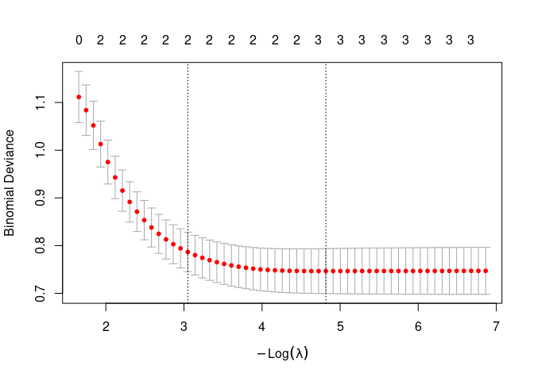
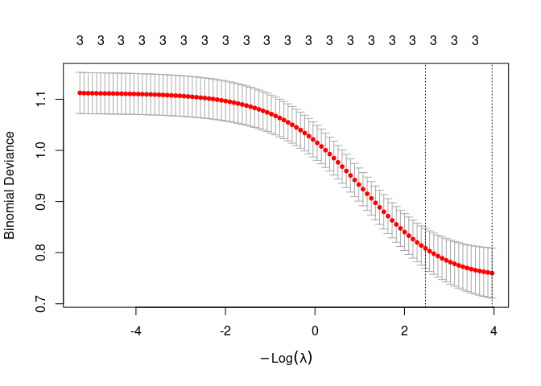
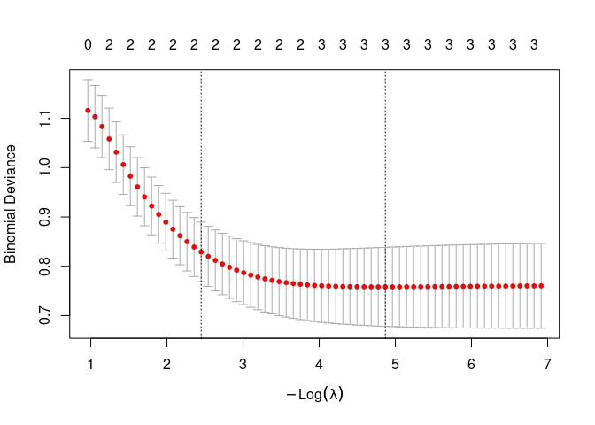
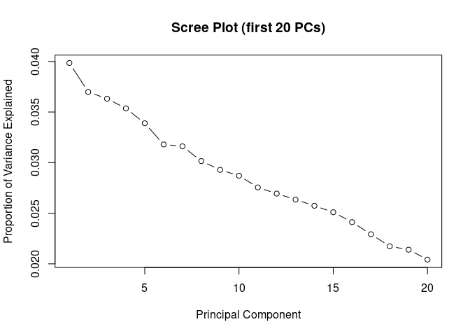
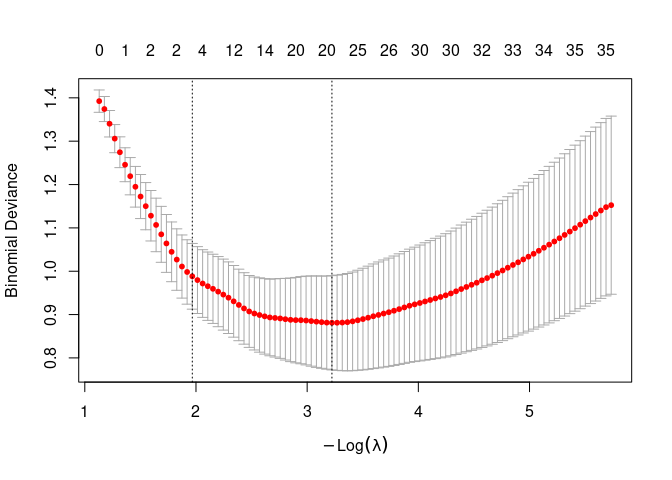
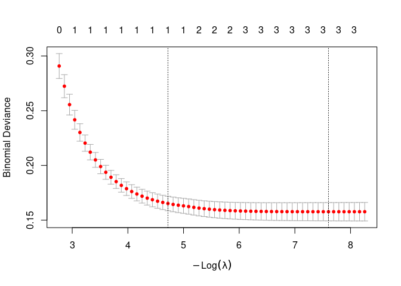

Lab1 – Introduction to Machine Learning in R
================

# 1. Overview

In this lab, you will:

- Review the basic workflow of **supervised learning** using **logistic
  regression**.
- Compare **classical logistic regression** with **penalized methods**:
  LASSO, Ridge, and Elastic Net.
- Explore a **high-dimensional setting** where the number of predictors
  is larger than the number of observations (**p \> n**).
- Use **PCA (Principal Component Analysis)** as an unsupervised tool for
  dimensionality reduction.
- Fit penalized models on high-dimensional data.
- Work through one **real-data example** using a publicly available
  dataset.

We will use the R packages **glmnet** (for penalized regression) and
**ISLR** (for a real dataset).  
If needed, install them before running the lab:

``` r
# install.packages("glmnet")
# install.packages("ISLR")
```

# 2. Example 1 – Logistic Regression & Penalized Methods (Supervised ML)

In this example, we simulate a binary outcome and a few predictors. We
then:

1.  Fit a **standard logistic regression** model.
2.  Fit **LASSO**, **Ridge**, and **Elastic Net** models.
3.  Compare their performance.

## 2.1 Simulate a binary classification dataset

We simulate 3 predictors where $X_1$ and $X_2$ are truly associated with
the outcome, and $X_3$ is mostly noise.

``` r
n <- 500

x1 <- rnorm(n, mean = 0, sd = 1)
x2 <- rnorm(n, mean = 1, sd = 1.5)
x3 <- rnorm(n, mean = 0, sd = 1)  # mostly noise

# True linear predictor
eta <- -0.5 + 1.2 * x1 - 1.0 * x2 + 0.1 * x3
prob <- 1 / (1 + exp(-eta))

y <- rbinom(n, size = 1, prob = prob)

data1 <- data.frame(y = factor(y), x1, x2, x3)
head(data1)
```

    ##   y          x1          x2          x3
    ## 1 0 -0.56047565  0.09716073 -0.99579872
    ## 2 1 -0.23017749 -0.49054789 -1.03995504
    ## 3 0  1.55870831  2.54017758 -0.01798024
    ## 4 0  0.07050839  2.12659195 -0.13217513
    ## 5 1  0.12928774 -1.26374981 -2.54934277
    ## 6 1  1.71506499  0.85727882  1.04057346

## 2.2 Train–test split

We split the data into training (70%) and test (30%) sets.

``` r
set.seed(123)
train_index <- sample(seq_len(nrow(data1)), size = 0.7 * nrow(data1))

train1 <- data1[train_index, ]
test1  <- data1[-train_index, ]

nrow(train1); nrow(test1)
```

    ## [1] 350

    ## [1] 150

## 2.3 Standard logistic regression (GLM)

``` r
fit_glm <- glm(y ~ x1 + x2 + x3,
               data = train1,
               family = binomial)

summary(fit_glm)
```

    ## 
    ## Call:
    ## glm(formula = y ~ x1 + x2 + x3, family = binomial, data = train1)
    ## 
    ## Deviance Residuals: 
    ##      Min        1Q    Median        3Q       Max  
    ## -2.30720  -0.55789  -0.29694  -0.06511   2.63055  
    ## 
    ## Coefficients:
    ##             Estimate Std. Error z value Pr(>|z|)    
    ## (Intercept) -0.78188    0.17272  -4.527 5.98e-06 ***
    ## x1           1.26506    0.20259   6.245 4.25e-10 ***
    ## x2          -1.00611    0.13918  -7.229 4.87e-13 ***
    ## x3           0.08461    0.15904   0.532    0.595    
    ## ---
    ## Signif. codes:  0 '***' 0.001 '**' 0.01 '*' 0.05 '.' 0.1 ' ' 1
    ## 
    ## (Dispersion parameter for binomial family taken to be 1)
    ## 
    ##     Null deviance: 388.05  on 349  degrees of freedom
    ## Residual deviance: 255.08  on 346  degrees of freedom
    ## AIC: 263.08
    ## 
    ## Number of Fisher Scoring iterations: 6

Make predictions and evaluate accuracy on the test set:

``` r
# Predict probabilities
pred_prob_glm <- predict(fit_glm, newdata = test1, type = "response")

# Classify using 0.5 cutoff
pred_class_glm <- ifelse(pred_prob_glm > 0.5, 1, 0)

# Confusion matrix
table(Predicted = pred_class_glm, Observed = test1$y)
```

    ##          Observed
    ## Predicted  0  1
    ##         0 90 24
    ##         1  5 31

``` r
# Accuracy
accuracy_glm <- mean(pred_class_glm == as.numeric(as.character(test1$y)))
accuracy_glm
```

    ## [1] 0.8066667

**Question 1 (for students):**  
- Which predictors appear statistically significant in the logistic
regression output?  
- How does this relate to how we simulated the data?

## 2.4 Penalized logistic regression: LASSO, Ridge, Elastic Net

We now fit penalized models using the **glmnet** package.

``` r
library(glmnet)

# glmnet expects matrix of predictors and numeric outcome (0/1)
x_train <- as.matrix(train1[, c("x1", "x2", "x3")])
y_train <- as.numeric(as.character(train1$y))

x_test  <- as.matrix(test1[, c("x1", "x2", "x3")])
y_test  <- as.numeric(as.character(test1$y))
```

### 2.4.1 LASSO (L1 penalty)

``` r
# alpha = 1 => LASSO
cv_lasso <- cv.glmnet(x_train, y_train,
                      family = "binomial",
                      alpha = 1,
                      nfolds = 10)

plot(cv_lasso)
```

<!-- -->

``` r
cv_lasso$lambda.min  # best lambda
```

    ## [1] 0.008090269

``` r
coef(cv_lasso, s = "lambda.min")
```

    ## 4 x 1 sparse Matrix of class "dgCMatrix"
    ##              lambda.min
    ## (Intercept) -0.78335303
    ## x1           1.13610971
    ## x2          -0.90987420
    ## x3           0.01196709

Evaluate LASSO on the test set:

``` r
pred_prob_lasso <- predict(cv_lasso, newx = x_test, s = "lambda.min", type = "response")
pred_class_lasso <- ifelse(pred_prob_lasso > 0.5, 1, 0)

table(Predicted = pred_class_lasso, Observed = y_test)
```

    ##          Observed
    ## Predicted  0  1
    ##         0 90 25
    ##         1  5 30

``` r
accuracy_lasso <- mean(pred_class_lasso == y_test)
accuracy_lasso
```

    ## [1] 0.8

### 2.4.2 Ridge (L2 penalty)

``` r
# alpha = 0 => Ridge
cv_ridge <- cv.glmnet(x_train, y_train,
                      family = "binomial",
                      alpha = 0,
                      nfolds = 10)

plot(cv_ridge)
```

<!-- -->

``` r
cv_ridge$lambda.min
```

    ## [1] 0.01912936

``` r
coef(cv_ridge, s = "lambda.min")
```

    ## 4 x 1 sparse Matrix of class "dgCMatrix"
    ##             lambda.min
    ## (Intercept) -0.7935993
    ## x1           0.9972352
    ## x2          -0.7825003
    ## x3           0.0607223

Evaluate Ridge:

``` r
pred_prob_ridge <- predict(cv_ridge, newx = x_test, s = "lambda.min", type = "response")
pred_class_ridge <- ifelse(pred_prob_ridge > 0.5, 1, 0)

table(Predicted = pred_class_ridge, Observed = y_test)
```

    ##          Observed
    ## Predicted  0  1
    ##         0 90 27
    ##         1  5 28

``` r
accuracy_ridge <- mean(pred_class_ridge == y_test)
accuracy_ridge
```

    ## [1] 0.7866667

### 2.4.3 Elastic Net (mix of L1 and L2)

We choose $\alpha = 0.5$ for a 50/50 mixture, but this can be tuned.

``` r
alpha_enet <- 0.5

cv_enet <- cv.glmnet(x_train, y_train,
                     family = "binomial",
                     alpha = alpha_enet,
                     nfolds = 10)

plot(cv_enet)
```

<!-- -->

``` r
cv_enet$lambda.min
```

    ## [1] 0.007687067

``` r
coef(cv_enet, s = "lambda.min")
```

    ## 4 x 1 sparse Matrix of class "dgCMatrix"
    ##              lambda.min
    ## (Intercept) -0.78426035
    ## x1           1.13555311
    ## x2          -0.90311469
    ## x3           0.04489156

Evaluate Elastic Net:

``` r
pred_prob_enet <- predict(cv_enet, newx = x_test, s = "lambda.min", type = "response")
pred_class_enet <- ifelse(pred_prob_enet > 0.5, 1, 0)

table(Predicted = pred_class_enet, Observed = y_test)
```

    ##          Observed
    ## Predicted  0  1
    ##         0 90 25
    ##         1  5 30

``` r
accuracy_enet <- mean(pred_class_enet == y_test)
accuracy_enet
```

    ## [1] 0.8

### 2.5 Compare model performances

``` r
data.frame(
  Model = c("Logistic (GLM)", "LASSO", "Ridge", "Elastic Net"),
  Accuracy = c(accuracy_glm, accuracy_lasso, accuracy_ridge, accuracy_enet)
)
```

    ##            Model  Accuracy
    ## 1 Logistic (GLM) 0.8066667
    ## 2          LASSO 0.8000000
    ## 3          Ridge 0.7866667
    ## 4    Elastic Net 0.8000000

**Question 2 (for students):** - Which model has the highest accuracy?  
- Look at the LASSO coefficients: did it shrink any variable close to
zero?  
- How does penalization help when we have many predictors or
multicollinearity?

# 3. Example 2 – High-Dimensional Data (p \> n), PCA & Penalization

In this example, we:

- Simulate a **high-dimensional dataset** with $n = 80$ observations and
  $p = 200$ predictors.
- Use **PCA** (unsupervised) for dimensionality reduction.
- Fit a **logistic regression** model using the leading principal
  components.
- Fit a **LASSO logistic regression** directly on the high-dimensional
  predictors.

This illustrates why ML (and penalized methods) are useful when **p \>
n**.

## 3.1 Simulate p \> n data

We let only a few predictors drive the true signal, and the rest act as
noise.

``` r
n_hd <- 80
p_hd <- 200

# Design matrix: standard normal
X_hd <- matrix(rnorm(n_hd * p_hd), nrow = n_hd, ncol = p_hd)

# True coefficients: only first 5 are nonzero
true_beta <- c(1.5, -1.0, 0.8, -0.7, 1.2, rep(0, p_hd - 5))

eta_hd <- X_hd %*% true_beta
prob_hd <- 1 / (1 + exp(-eta_hd))
y_hd <- rbinom(n_hd, size = 1, prob = prob_hd)

y_hd <- as.numeric(y_hd)
dim(X_hd)
```

    ## [1]  80 200

``` r
head(y_hd)
```

    ## [1] 0 0 1 0 1 0

Train–test split:

``` r
set.seed(123)
train_index_hd <- sample(seq_len(n_hd), size = 0.7 * n_hd)

X_train_hd <- X_hd[train_index_hd, ]
X_test_hd  <- X_hd[-train_index_hd, ]

y_train_hd <- y_hd[train_index_hd]
y_test_hd  <- y_hd[-train_index_hd]

length(y_train_hd); length(y_test_hd)
```

    ## [1] 56

    ## [1] 24

## 3.2 PCA (unsupervised step)

PCA is an **unsupervised** method: it ignores the outcome and tries to
summarize the variance in the predictors.

``` r
pca_hd <- prcomp(X_train_hd, center = TRUE, scale. = TRUE)

# Proportion of variance explained
pve <- pca_hd$sdev^2 / sum(pca_hd$sdev^2)

plot(pve[1:20], type = "b",
     xlab = "Principal Component",
     ylab = "Proportion of Variance Explained",
     main = "Scree Plot (first 20 PCs)")
```

<!-- -->

Select enough PCs to explain, say, ~80–90% of the variance:

``` r
cum_pve <- cumsum(pve)
which(cum_pve >= 0.80)[1]  # first PC index reaching 80%
```

    ## [1] 34

``` r
which(cum_pve >= 0.90)[1]  # first PC index reaching 90%
```

    ## [1] 42

Let’s take the first 20 PCs (for illustration).

``` r
k <- 20
Z_train <- pca_hd$x[, 1:k]

# Get PC scores for the test data
Z_test <- predict(pca_hd, newdata = X_test_hd)[, 1:k]

dim(Z_train); dim(Z_test)
```

    ## [1] 56 20

    ## [1] 24 20

## 3.3 Logistic regression on PCs (supervised model after PCA)

``` r
pca_data_train <- data.frame(y = factor(y_train_hd), Z_train)
pca_data_test  <- data.frame(y = factor(y_test_hd), Z_test)

fit_glm_pca <- glm(y ~ ., data = pca_data_train, family = binomial)
summary(fit_glm_pca)
```

    ## 
    ## Call:
    ## glm(formula = y ~ ., family = binomial, data = pca_data_train)
    ## 
    ## Deviance Residuals: 
    ##        Min          1Q      Median          3Q         Max  
    ## -2.339e-05  -2.110e-08  -2.110e-08   2.110e-08   2.490e-05  
    ## 
    ## Coefficients:
    ##               Estimate Std. Error z value Pr(>|z|)
    ## (Intercept)   -10.8844 27009.7618   0.000    1.000
    ## PC1             5.8119 15824.3057   0.000    1.000
    ## PC2           -10.0645 17002.8460  -0.001    1.000
    ## PC3            13.1867 12218.0701   0.001    0.999
    ## PC4            -5.4960 14016.2794   0.000    1.000
    ## PC5           -45.5201 27559.0170  -0.002    0.999
    ## PC6             0.8602 11391.7215   0.000    1.000
    ## PC7            -4.6658 24407.5686   0.000    1.000
    ## PC8            -4.7221 21628.4000   0.000    1.000
    ## PC9            -2.6138 21126.2167   0.000    1.000
    ## PC10          -18.6379 29075.4857  -0.001    0.999
    ## PC11           -1.3395 18733.9570   0.000    1.000
    ## PC12           -4.8297  9574.3763  -0.001    1.000
    ## PC13          -10.3975 25919.7505   0.000    1.000
    ## PC14          -17.2574 11831.7473  -0.001    0.999
    ## PC15           14.8863 21376.8243   0.001    0.999
    ## PC16            1.2611 10227.2751   0.000    1.000
    ## PC17            0.4723 17167.6794   0.000    1.000
    ## PC18          -14.8187 15601.4427  -0.001    0.999
    ## PC19           -6.2675 15404.5960   0.000    1.000
    ## PC20          -15.8044 24149.7427  -0.001    0.999
    ## 
    ## (Dispersion parameter for binomial family taken to be 1)
    ## 
    ##     Null deviance: 7.6486e+01  on 55  degrees of freedom
    ## Residual deviance: 5.4891e-09  on 35  degrees of freedom
    ## AIC: 42
    ## 
    ## Number of Fisher Scoring iterations: 25

Evaluate performance:

``` r
pred_prob_pca_glm <- predict(fit_glm_pca, newdata = pca_data_test, type = "response")
pred_class_pca_glm <- ifelse(pred_prob_pca_glm > 0.5, 1, 0)

table(Predicted = pred_class_pca_glm, Observed = y_test_hd)
```

    ##          Observed
    ## Predicted 0 1
    ##         0 6 7
    ##         1 6 5

``` r
accuracy_pca_glm <- mean(pred_class_pca_glm == y_test_hd)
accuracy_pca_glm
```

    ## [1] 0.4583333

**Question 3 (for students):** - Why was it helpful (or necessary) to
reduce dimensionality with PCA before fitting a logistic regression in
this p \> n setting?  
- Is PCA supervised or unsupervised? Explain.

## 3.4 LASSO directly on high-dimensional predictors

Now we skip PCA and fit a LASSO model directly on $X$. This is a typical
ML approach in high-dimensional data.

``` r
cv_lasso_hd <- cv.glmnet(X_train_hd, y_train_hd,
                         family = "binomial",
                         alpha = 1,
                         nfolds = 10)

plot(cv_lasso_hd)
```

<!-- -->

``` r
cv_lasso_hd$lambda.min
```

    ## [1] 0.03984284

Look at selected coefficients:

``` r
coef_lasso_hd <- coef(cv_lasso_hd, s = "lambda.min")
coef_lasso_hd[1:15, ]  # first 15 coefficients (including intercept)
```

    ## (Intercept)          V1          V2          V3          V4          V5 
    ##  -0.3555945   0.7260110  -1.1286058   0.0000000  -0.5101633   0.4454439 
    ##          V6          V7          V8          V9         V10         V11 
    ##   0.0000000   0.0000000   0.0000000   0.0000000   0.0000000   0.0000000 
    ##         V12         V13         V14 
    ##   0.0855619   0.0000000   0.0000000

Evaluate performance:

``` r
pred_prob_lasso_hd <- predict(cv_lasso_hd, newx = X_test_hd, s = "lambda.min", type = "response")
pred_class_lasso_hd <- ifelse(pred_prob_lasso_hd > 0.5, 1, 0)

table(Predicted = pred_class_lasso_hd, Observed = y_test_hd)
```

    ##          Observed
    ## Predicted  0  1
    ##         0 10  2
    ##         1  2 10

``` r
accuracy_lasso_hd <- mean(pred_class_lasso_hd == y_test_hd)
accuracy_lasso_hd
```

    ## [1] 0.8333333

## 3.5 Compare PCA+GLM vs LASSO in high-dimensional setting

``` r
data.frame(
  Model = c("GLM on first 20 PCs", "LASSO on all 200 predictors"),
  Accuracy = c(accuracy_pca_glm, accuracy_lasso_hd)
)
```

    ##                         Model  Accuracy
    ## 1         GLM on first 20 PCs 0.4583333
    ## 2 LASSO on all 200 predictors 0.8333333

> **Question 4 (for students):** - Which approach performs better in
> this simulation: PCA + logistic regression or LASSO on all
> predictors?  
> - How might your choice depend on interpretability vs predictive
> performance in a real biomedical dataset?

# 4. Example 3 – Real Data: Credit Default (ISLR::Default)

In this final example, we use a **real dataset** from the **ISLR**
package: `Default`, which contains information on individuals and
whether they defaulted on their credit card debt.

We will:

1.  Explore the data.
2.  Fit a standard logistic regression model.
3.  Fit a LASSO logistic regression model.
4.  Compare predictions and discuss when ML adds value.

## 4.1 Load and explore the data

``` r
library(ISLR)  # may need: install.packages("ISLR")

data("Default")
str(Default)
```

    ## 'data.frame':    10000 obs. of  4 variables:
    ##  $ default: Factor w/ 2 levels "No","Yes": 1 1 1 1 1 1 1 1 1 1 ...
    ##  $ student: Factor w/ 2 levels "No","Yes": 1 2 1 1 1 2 1 2 1 1 ...
    ##  $ balance: num  730 817 1074 529 786 ...
    ##  $ income : num  44362 12106 31767 35704 38463 ...

``` r
head(Default)
```

    ##   default student   balance    income
    ## 1      No      No  729.5265 44361.625
    ## 2      No     Yes  817.1804 12106.135
    ## 3      No      No 1073.5492 31767.139
    ## 4      No      No  529.2506 35704.494
    ## 5      No      No  785.6559 38463.496
    ## 6      No     Yes  919.5885  7491.559

``` r
summary(Default)
```

    ##  default    student       balance           income     
    ##  No :9667   No :7056   Min.   :   0.0   Min.   :  772  
    ##  Yes: 333   Yes:2944   1st Qu.: 481.7   1st Qu.:21340  
    ##                        Median : 823.6   Median :34553  
    ##                        Mean   : 835.4   Mean   :33517  
    ##                        3rd Qu.:1166.3   3rd Qu.:43808  
    ##                        Max.   :2654.3   Max.   :73554

The main variables are:

- `default`: Yes/No (outcome)
- `student`: Yes/No
- `balance`: average credit card balance
- `income`: income

We create a binary outcome (`y = 1` if default == “Yes”).

``` r
Default$y <- ifelse(Default$default == "Yes", 1, 0)

# Simple exploratory plots
plot(Default$balance, Default$y,
     xlab = "Balance", ylab = "Default (0/1)",
     main = "Credit Card Balance vs Default")
```

<!-- -->

``` r
table(Default$default, Default$student)
```

    ##      
    ##         No  Yes
    ##   No  6850 2817
    ##   Yes  206  127

## 4.2 Train–test split

``` r
set.seed(123)
n_def <- nrow(Default)
train_index_def <- sample(seq_len(n_def), size = 0.7 * n_def)

train_def <- Default[train_index_def, ]
test_def  <- Default[-train_index_def, ]

nrow(train_def); nrow(test_def)
```

    ## [1] 7000

    ## [1] 3000

## 4.3 Standard logistic regression

``` r
fit_glm_def <- glm(y ~ student + balance + income,
                   data = train_def,
                   family = binomial)

summary(fit_glm_def)
```

    ## 
    ## Call:
    ## glm(formula = y ~ student + balance + income, family = binomial, 
    ##     data = train_def)
    ## 
    ## Deviance Residuals: 
    ##     Min       1Q   Median       3Q      Max  
    ## -2.1583  -0.1409  -0.0567  -0.0205   3.7368  
    ## 
    ## Coefficients:
    ##               Estimate Std. Error z value Pr(>|z|)    
    ## (Intercept) -1.109e+01  5.923e-01 -18.723   <2e-16 ***
    ## studentYes  -5.222e-01  2.828e-01  -1.847   0.0648 .  
    ## balance      5.760e-03  2.772e-04  20.777   <2e-16 ***
    ## income       7.592e-06  9.799e-06   0.775   0.4385    
    ## ---
    ## Signif. codes:  0 '***' 0.001 '**' 0.01 '*' 0.05 '.' 0.1 ' ' 1
    ## 
    ## (Dispersion parameter for binomial family taken to be 1)
    ## 
    ##     Null deviance: 2043.8  on 6999  degrees of freedom
    ## Residual deviance: 1094.9  on 6996  degrees of freedom
    ## AIC: 1102.9
    ## 
    ## Number of Fisher Scoring iterations: 8

Predict and evaluate:

``` r
pred_prob_glm_def <- predict(fit_glm_def, newdata = test_def, type = "response")
pred_class_glm_def <- ifelse(pred_prob_glm_def > 0.5, 1, 0)

table(Predicted = pred_class_glm_def, Observed = test_def$y)
```

    ##          Observed
    ## Predicted    0    1
    ##         0 2889   70
    ##         1   11   30

``` r
accuracy_glm_def <- mean(pred_class_glm_def == test_def$y)
accuracy_glm_def
```

    ## [1] 0.973

Because default is rare, accuracy alone can be misleading. Compute
sensitivity and specificity:

``` r
glm_cm <- table(Predicted = pred_class_glm_def, Observed = test_def$y)

tn <- glm_cm["0","0"]
tp <- glm_cm["1","1"]
fn <- glm_cm["0","1"]
fp <- glm_cm["1","0"]

sensitivity_glm <- tp / (tp + fn)
specificity_glm <- tn / (tn + fp)

c(Accuracy = accuracy_glm_def,
  Sensitivity = sensitivity_glm,
  Specificity = specificity_glm)
```

    ##    Accuracy Sensitivity Specificity 
    ##   0.9730000   0.3000000   0.9962069

## 4.4 LASSO logistic regression on real data

We now treat this as a simple ML problem with penalization. For
illustration, we include interaction terms and let LASSO decide which to
keep.

``` r
# Create model matrix with main effects and interaction
x_def <- model.matrix(y ~ student * (balance + income), data = Default)[, -1]  # remove intercept
y_def <- Default$y

# Train–test split aligned with previous split
x_train_def <- x_def[train_index_def, ]
x_test_def  <- x_def[-train_index_def, ]
y_train_def <- y_def[train_index_def]
y_test_def  <- y_def[-train_index_def]
```

Fit LASSO:

``` r
cv_lasso_def <- cv.glmnet(x_train_def, y_train_def,
                          family = "binomial",
                          alpha = 1,
                          nfolds = 10)

plot(cv_lasso_def)
```

<!-- -->

``` r
cv_lasso_def$lambda.min
```

    ## [1] 0.0004985238

``` r
coef(cv_lasso_def, s = "lambda.min")
```

    ## 6 x 1 sparse Matrix of class "dgCMatrix"
    ##                       lambda.min
    ## (Intercept)        -1.096051e+01
    ## studentYes          .           
    ## balance             5.740254e-03
    ## income              4.964011e-06
    ## studentYes:balance -3.260835e-04
    ## studentYes:income   .

Predict and evaluate:

``` r
pred_prob_lasso_def <- predict(cv_lasso_def, newx = x_test_def, s = "lambda.min", type = "response")
pred_class_lasso_def <- ifelse(pred_prob_lasso_def > 0.5, 1, 0)

lasso_cm <- table(Predicted = pred_class_lasso_def, Observed = y_test_def)
lasso_cm
```

    ##          Observed
    ## Predicted    0    1
    ##         0 2889   71
    ##         1   11   29

``` r
accuracy_lasso_def <- mean(pred_class_lasso_def == y_test_def)

tn_l <- lasso_cm["0","0"]
tp_l <- lasso_cm["1","1"]
fn_l <- lasso_cm["0","1"]
fp_l <- lasso_cm["1","0"]

sensitivity_lasso <- tp_l / (tp_l + fn_l)
specificity_lasso <- tn_l / (tn_l + fp_l)

c(Accuracy = accuracy_lasso_def,
  Sensitivity = sensitivity_lasso,
  Specificity = specificity_lasso)
```

    ##    Accuracy Sensitivity Specificity 
    ##   0.9726667   0.2900000   0.9962069

## 4.5 Compare logistic regression vs LASSO on real data

``` r
data.frame(
  Model = c("GLM", "LASSO"),
  Accuracy = c(accuracy_glm_def, accuracy_lasso_def),
  Sensitivity = c(sensitivity_glm, sensitivity_lasso),
  Specificity = c(specificity_glm, specificity_lasso)
)
```

    ##   Model  Accuracy Sensitivity Specificity
    ## 1   GLM 0.9730000        0.30   0.9962069
    ## 2 LASSO 0.9726667        0.29   0.9962069

**Questions for students (Real Data):** 1. Which model (GLM vs LASSO)
performs better in terms of sensitivity and specificity? 2. Look at the
LASSO coefficients: which variables or interactions are shrunk toward
zero? 3. How would you explain the added value of penalized ML methods
to a clinician or non-statistical collaborator?

# 5. Reflection

1.  In Example 1, how did penalized methods compare to the standard
    logistic regression in terms of:

    - Accuracy?
    - Coefficient shrinkage and variable selection?

2.  In Example 2, why are ML methods like LASSO (and dimensionality
    reduction via PCA) especially useful when we have **more variables
    than observations**?

3.  In the real-data example (Example 3):

    - Does penalization improve sensitivity or specificity compared to
      the standard GLM?
    - How might class imbalance affect your model evaluation?

4.  Think about your own research data:

    - Where might **supervised learning** (e.g., penalized logistic
      regression) be appropriate?
    - Where might **unsupervised learning** (e.g., PCA or clustering) be
      more useful?

------------------------------------------------------------------------

**End of Lab**

You can modify the simulation settings (sample size, number of
predictors, signal strength) to explore how model performance changes,
and you can replace the real dataset with one from your own research
domain.
