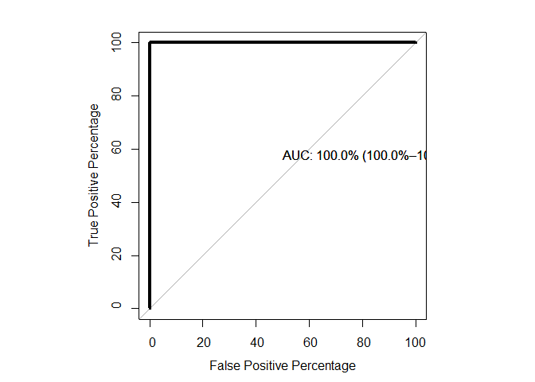

Lab3 – Machine Learning Workshop R codes
================

## ML codes

Now are trying to practice the machine learning for iris data. First we
call the packages:

## iris data set

## Table 1

<table class="Rtable1">
<thead>
<tr>
<th class='rowlabel firstrow lastrow'></th>
<th class='firstrow lastrow'>No (N=100)</th>
<th class='firstrow lastrow'>Yes (N=50)</th>
<th class='firstrow lastrow'>Overall (N=150)</th>
</tr>
</thead>
<tbody>
<tr>
<td class='rowlabel firstrow'>Sepal.Length</td>
<td class='firstrow'></td>
<td class='firstrow'></td>
<td class='firstrow'></td>
</tr>
<tr>
<td class='rowlabel'>Mean (SD)</td>
<td>5.80 (0.945)</td>
<td>5.94 (0.516)</td>
<td>5.84 (0.828)</td>
</tr>
<tr>
<td class='rowlabel lastrow'>Median [Min, Max]</td>
<td class='lastrow'>5.70 [4.30, 7.90]</td>
<td class='lastrow'>5.90 [4.90, 7.00]</td>
<td class='lastrow'>5.80 [4.30, 7.90]</td>
</tr>
<tr>
<td class='rowlabel firstrow'>Sepal.Width</td>
<td class='firstrow'></td>
<td class='firstrow'></td>
<td class='firstrow'></td>
</tr>
<tr>
<td class='rowlabel'>Mean (SD)</td>
<td>3.20 (0.418)</td>
<td>2.77 (0.314)</td>
<td>3.06 (0.436)</td>
</tr>
<tr>
<td class='rowlabel lastrow'>Median [Min, Max]</td>
<td class='lastrow'>3.20 [2.20, 4.40]</td>
<td class='lastrow'>2.80 [2.00, 3.40]</td>
<td class='lastrow'>3.00 [2.00, 4.40]</td>
</tr>
<tr>
<td class='rowlabel firstrow'>Petal.Length</td>
<td class='firstrow'></td>
<td class='firstrow'></td>
<td class='firstrow'></td>
</tr>
<tr>
<td class='rowlabel'>Mean (SD)</td>
<td>3.51 (2.10)</td>
<td>4.26 (0.470)</td>
<td>3.76 (1.77)</td>
</tr>
<tr>
<td class='rowlabel lastrow'>Median [Min, Max]</td>
<td class='lastrow'>3.20 [1.00, 6.90]</td>
<td class='lastrow'>4.35 [3.00, 5.10]</td>
<td class='lastrow'>4.35 [1.00, 6.90]</td>
</tr>
<tr>
<td class='rowlabel firstrow'>Petal.Width</td>
<td class='firstrow'></td>
<td class='firstrow'></td>
<td class='firstrow'></td>
</tr>
<tr>
<td class='rowlabel'>Mean (SD)</td>
<td>1.14 (0.918)</td>
<td>1.33 (0.198)</td>
<td>1.20 (0.762)</td>
</tr>
<tr>
<td class='rowlabel lastrow'>Median [Min, Max]</td>
<td class='lastrow'>1.00 [0.100, 2.50]</td>
<td class='lastrow'>1.30 [1.00, 1.80]</td>
<td class='lastrow'>1.30 [0.100, 2.50]</td>
</tr>
</tbody>
</table>

## Table 2

<table class="Rtable1">
<thead>
<tr>
<th class='rowlabel firstrow lastrow'></th>
<th class='firstrow lastrow'>No (N=100)</th>
<th class='firstrow lastrow'>Yes (N=50)</th>
<th class='firstrow lastrow'>Overall (N=150)</th>
</tr>
</thead>
<tbody>
<tr>
<td class='rowlabel firstrow'>Sepal.Length</td>
<td class='firstrow'></td>
<td class='firstrow'></td>
<td class='firstrow'></td>
</tr>
<tr>
<td class='rowlabel'>Mean (SD)</td>
<td>5.80 (0.945)</td>
<td>5.94 (0.516)</td>
<td>5.84 (0.828)</td>
</tr>
<tr>
<td class='rowlabel lastrow'>Median [Min, Max]</td>
<td class='lastrow'>5.70 [4.30, 7.90]</td>
<td class='lastrow'>5.90 [4.90, 7.00]</td>
<td class='lastrow'>5.80 [4.30, 7.90]</td>
</tr>
<tr>
<td class='rowlabel firstrow'>Sepal.Width</td>
<td class='firstrow'></td>
<td class='firstrow'></td>
<td class='firstrow'></td>
</tr>
<tr>
<td class='rowlabel'>Mean (SD)</td>
<td>3.20 (0.418)</td>
<td>2.77 (0.314)</td>
<td>3.06 (0.436)</td>
</tr>
<tr>
<td class='rowlabel lastrow'>Median [Min, Max]</td>
<td class='lastrow'>3.20 [2.20, 4.40]</td>
<td class='lastrow'>2.80 [2.00, 3.40]</td>
<td class='lastrow'>3.00 [2.00, 4.40]</td>
</tr>
<tr>
<td class='rowlabel firstrow'>Petal.Length</td>
<td class='firstrow'></td>
<td class='firstrow'></td>
<td class='firstrow'></td>
</tr>
<tr>
<td class='rowlabel'>Mean (SD)</td>
<td>3.51 (2.10)</td>
<td>4.26 (0.470)</td>
<td>3.76 (1.77)</td>
</tr>
<tr>
<td class='rowlabel lastrow'>Median [Min, Max]</td>
<td class='lastrow'>3.20 [1.00, 6.90]</td>
<td class='lastrow'>4.35 [3.00, 5.10]</td>
<td class='lastrow'>4.35 [1.00, 6.90]</td>
</tr>
<tr>
<td class='rowlabel firstrow'>Petal.Width</td>
<td class='firstrow'></td>
<td class='firstrow'></td>
<td class='firstrow'></td>
</tr>
<tr>
<td class='rowlabel'>Mean (SD)</td>
<td>1.14 (0.918)</td>
<td>1.33 (0.198)</td>
<td>1.20 (0.762)</td>
</tr>
<tr>
<td class='rowlabel lastrow'>Median [Min, Max]</td>
<td class='lastrow'>1.00 [0.100, 2.50]</td>
<td class='lastrow'>1.30 [1.00, 1.80]</td>
<td class='lastrow'>1.30 [0.100, 2.50]</td>
</tr>
</tbody>
</table>

## tarin and test

    ## [1] 105   5

    ## Sepal.Length  Sepal.Width Petal.Length  Petal.Width      Species 
    ##    "numeric"    "numeric"    "numeric"    "numeric"     "factor"

    ##    Sepal.Length Sepal.Width Petal.Length Petal.Width Species
    ## 4           4.6         3.1          1.5         0.2      No
    ## 5           5.0         3.6          1.4         0.2      No
    ## 6           5.4         3.9          1.7         0.4      No
    ## 7           4.6         3.4          1.4         0.3      No
    ## 8           5.0         3.4          1.5         0.2      No
    ## 12          4.8         3.4          1.6         0.2      No

    ## [1] "No"  "Yes"

    ##     freq percentage
    ## No    70   66.66667
    ## Yes   35   33.33333

## split input and output

## some plots

<!-- --><!-- -->
<!-- -->

## set the cross-validation and metric

## Logistics regression

## LASSO

## DT

<!-- --> \## RF

## Varible importance

<!-- -->

## SVM

    ## Warning: package 'kernlab' was built under R version 4.3.3

    ## 
    ## Attaching package: 'kernlab'

    ## The following object is masked from 'package:purrr':
    ## 
    ##     cross

    ## The following object is masked from 'package:ggplot2':
    ## 
    ##     alpha

<!-- -->

<!-- -->

## ANN

We can use the **train()** function from the caret package to tune our
hyperparameters. Here, we will use the **nnet** package (method =
“nnet”). We can tune the size and decay hyperparameters.

- size: number of nodes in the hidden layer Note: There can only be one
  hidden layer using nnet
- decay: weight decay. regularization parameter to avoid overfitting,
  which adds a penalty for complexity.

First, we set up the grid using the expand.grid() function. We will
consider hidden node sizes (size) of 1, 3, 5 and 7 and decay values
ranging from 0 to 0.1 in 0.01 increments.

<!-- -->

<!-- -->

## summary of results in training data

    ## 
    ## Call:
    ## summary.resamples(object = results)
    ## 
    ## Models: logistic_regression, Elastic_net, knn, DT, RF, XGboost, SVM_linear1, SVM_nonlinear, ANN 
    ## Number of resamples: 10 
    ## 
    ## ROC 
    ##                          Min.   1st Qu.    Median      Mean   3rd Qu.      Max.
    ## logistic_regression 0.3214286 0.7916667 0.8333333 0.8071429 0.9196429 1.0000000
    ## Elastic_net         0.4642857 0.7321429 0.8154762 0.7880952 0.8571429 1.0000000
    ## knn                 0.9285714 1.0000000 1.0000000 0.9928571 1.0000000 1.0000000
    ## DT                  0.8333333 0.8616071 0.9285714 0.9208333 0.9821429 1.0000000
    ## RF                  0.9047619 1.0000000 1.0000000 0.9904762 1.0000000 1.0000000
    ## XGboost             0.9642857 1.0000000 1.0000000 0.9928571 1.0000000 1.0000000
    ## SVM_linear1         0.6071429 0.6250000 0.8095238 0.7761905 0.8928571 0.9642857
    ## SVM_nonlinear       0.9523810 1.0000000 1.0000000 0.9952381 1.0000000 1.0000000
    ## ANN                 0.7142857 1.0000000 1.0000000 0.9666667 1.0000000 1.0000000
    ##                     NA's
    ## logistic_regression    0
    ## Elastic_net            0
    ## knn                    0
    ## DT                     0
    ## RF                     0
    ## XGboost                0
    ## SVM_linear1            0
    ## SVM_nonlinear          0
    ## ANN                    0
    ## 
    ## Sens 
    ##                          Min.   1st Qu.    Median      Mean   3rd Qu. Max. NA's
    ## logistic_regression 0.7142857 0.7142857 0.8571429 0.8571429 1.0000000    1    0
    ## Elastic_net         0.7142857 0.7500000 0.8571429 0.8428571 0.8571429    1    0
    ## knn                 0.8571429 0.8571429 1.0000000 0.9428571 1.0000000    1    0
    ## DT                  0.7142857 0.8571429 0.9285714 0.9000000 1.0000000    1    0
    ## RF                  0.8571429 0.8928571 1.0000000 0.9571429 1.0000000    1    0
    ## XGboost             0.8571429 0.8571429 1.0000000 0.9428571 1.0000000    1    0
    ## SVM_linear1         0.5714286 0.8571429 0.9285714 0.8857143 1.0000000    1    0
    ## SVM_nonlinear       0.8571429 0.8928571 1.0000000 0.9571429 1.0000000    1    0
    ## ANN                 0.7142857 0.8928571 1.0000000 0.9285714 1.0000000    1    0
    ## 
    ## Spec 
    ##                          Min.   1st Qu.    Median      Mean 3rd Qu.      Max.
    ## logistic_regression 0.0000000 0.2708333 0.4166667 0.4583333   0.625 1.0000000
    ## Elastic_net         0.0000000 0.2708333 0.4166667 0.4500000   0.625 1.0000000
    ## knn                 0.6666667 1.0000000 1.0000000 0.9416667   1.000 1.0000000
    ## DT                  0.6666667 1.0000000 1.0000000 0.9416667   1.000 1.0000000
    ## RF                  0.3333333 1.0000000 1.0000000 0.9333333   1.000 1.0000000
    ## XGboost             0.7500000 1.0000000 1.0000000 0.9500000   1.000 1.0000000
    ## SVM_linear1         0.2500000 0.2708333 0.3333333 0.4083333   0.500 0.6666667
    ## SVM_nonlinear       0.6666667 1.0000000 1.0000000 0.9416667   1.000 1.0000000
    ## ANN                 0.6666667 0.8125000 1.0000000 0.9083333   1.000 1.0000000
    ##                     NA's
    ## logistic_regression    0
    ## Elastic_net            0
    ## knn                    0
    ## DT                     0
    ## RF                     0
    ## XGboost                0
    ## SVM_linear1            0
    ## SVM_nonlinear          0
    ## ANN                    0

<!-- -->

## Prediction

## ROC curve

    ##  [1] No  No  No  No  No  No  No  No  No  No  No  No  No  No  No  No  No  No  No 
    ## [20] No  No  No  Yes Yes Yes Yes Yes Yes Yes Yes Yes Yes Yes Yes Yes Yes Yes No 
    ## [39] No  No  No  No  No  No  No 
    ## Levels: No Yes

    ##                
    ## predictions_svm No Yes
    ##             No  30   2
    ##             Yes  0  13

    ## Confusion Matrix and Statistics
    ## 
    ##           Reference
    ## Prediction No Yes
    ##        No  30   2
    ##        Yes  0  13
    ##                                           
    ##                Accuracy : 0.9556          
    ##                  95% CI : (0.8485, 0.9946)
    ##     No Information Rate : 0.6667          
    ##     P-Value [Acc > NIR] : 3.227e-06       
    ##                                           
    ##                   Kappa : 0.8966          
    ##                                           
    ##  Mcnemar's Test P-Value : 0.4795          
    ##                                           
    ##             Sensitivity : 1.0000          
    ##             Specificity : 0.8667          
    ##          Pos Pred Value : 0.9375          
    ##          Neg Pred Value : 1.0000          
    ##              Prevalence : 0.6667          
    ##          Detection Rate : 0.6667          
    ##    Detection Prevalence : 0.7111          
    ##       Balanced Accuracy : 0.9333          
    ##                                           
    ##        'Positive' Class : No              
    ## 

    ##  [1] No No No No No No No No No No
    ## Levels: No Yes

    ## Setting levels: control = No, case = Yes

    ## Setting direction: controls < cases

    ## Warning in ci.auc.roc(roc, ...): ci.auc() of a ROC curve with AUC == 1 is
    ## always 1-1 and can be misleading.

<!-- -->

## Random Over sampling

Functions to deal with binary classification problems in the presence of
imbalanced classes. Synthetic balanced samples are generated according
to ROSE (Menardi and Torelli, 2014). Functions that implement more
traditional remedies to the class imbalance are also provided, as well
as different metrics to evaluate a learner accuracy. These are estimated
by holdout, bootrstrap or cross-validation methods.

### Example

    ## 
    ##   0   1 
    ## 980  20

    ## 
    ##   0   1 
    ## 507 493

## compare balanced and imbalanced

    ## Area under the curve (AUC): 0.803

<!-- -->

    ## Area under the curve (AUC): 0.915

## Roc Eval

    ## Iteration: 
    ## 1, 2, 3, 4, 5, 6, 7, 8, 9, 10

    ## 
    ## Call: 
    ## ROSE.eval(formula = cls ~ ., data = hacide.train, learner = glm, 
    ##     method.assess = "BOOT", B = 10, control.learner = list(family = binomial), 
    ##     trace = TRUE)
    ## 
    ## Summary of bootstrap distribution of auc: 
    ##    Min. 1st Qu.  Median    Mean 3rd Qu.    Max. 
    ##  0.9274  0.9277  0.9278  0.9280  0.9282  0.9291
